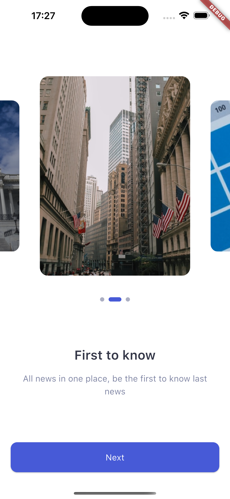
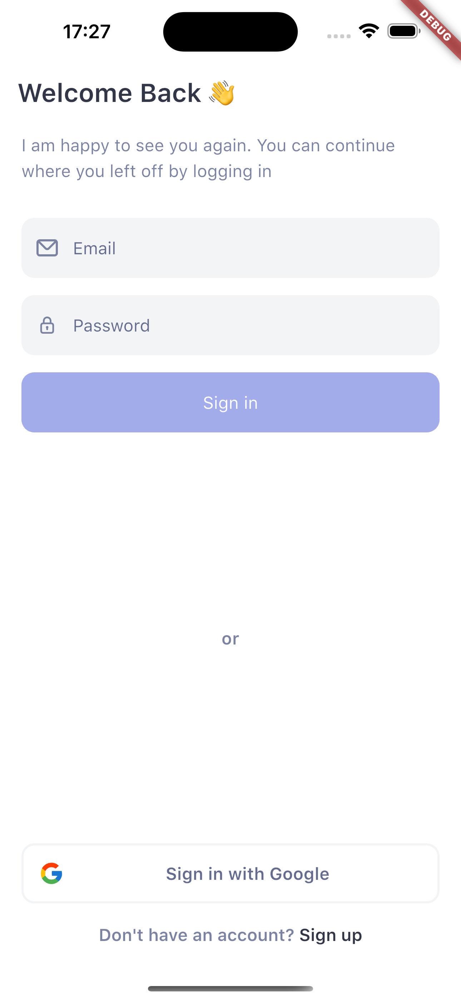
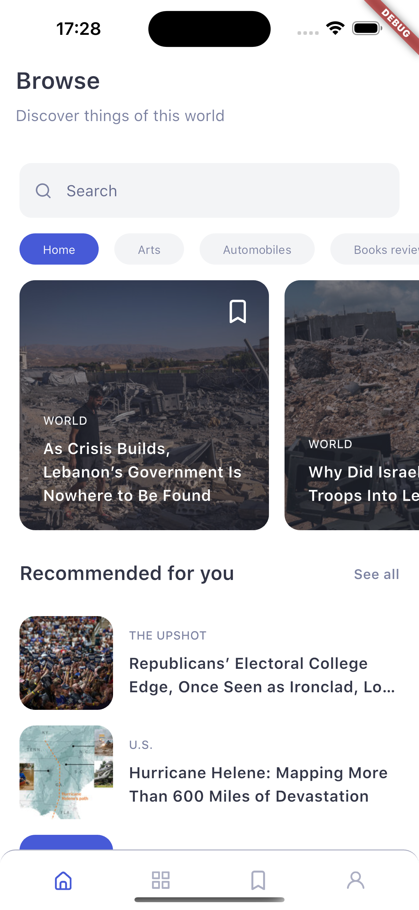
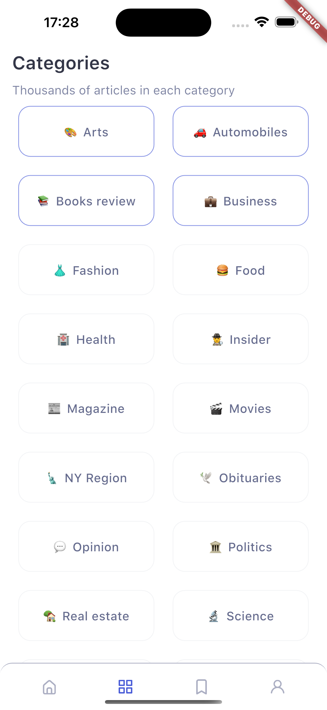
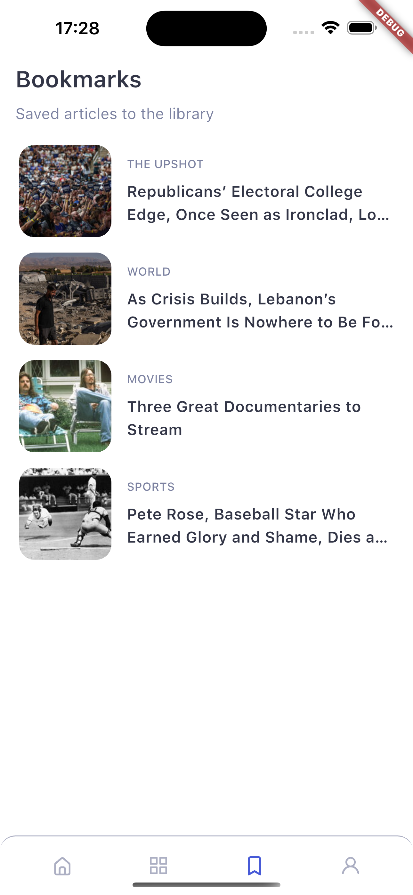

# Nuntium


Nuntium is a Flutter application that brings news to your fingertips with a beautiful and modern design. It implements the [Nuntium News App UI Kit](https://ui8.net/eren/products/nuntium-news-app) and utilizes the [New York Times APIs](https://developer.nytimes.com/apis) to fetch the latest news articles.

## Overview

  

This project is a Flutter-based implementation of the Nuntium News App UI, providing users with an engaging and intuitive news reading experience. It leverages the New York Times APIs to deliver up-to-date news content across various categories.

## Features

  

•  **Modern UI/UX**: Recreates the sleek design of the Nuntium News App UI Kit.

•  **Latest News**: Fetches real-time news articles from the New York Times.

•  **Multiple Categories**: Browse news across different sections like Technology, Sports, Business, and more.

•  **User Authentication**: Supports email/password, Google Sign-In, and Apple Sign-In authentication methods.

•  **Personalized Experience**: Save favorite articles and customize your news feed.

**Getting Started**

  

## Prerequisites

  •  **Flutter SDK**: Make sure you have Flutter installed on your machine. The application was tested on **Flutter (Channel stable, 3.24.3)**. [Install Flutter](https://flutter.dev/docs/get-started/install)

•  **Dart**: Dart comes bundled with Flutter.

•  **IDE**: You can use any IDE you prefer, such as Android Studio, VS Code, or IntelliJ IDEA.

•  **New York Times API Key**: Sign up for a developer account to get your API key. [Get NYTimes API Key](https://developer.nytimes.com/)

## Installation steps
1. **Install Dependencies** 
```
flutter pub get 
```
2.  **Configure API Keys**

•  Create a .env file in the root directory.

•  Add your New York Times API key:
```
API_KEY=your_api_key

BASE_ENDPOINT=/svc

API_VERSION=v2
```
3. **Run setup script**
```
dart run scripts/setup,dart
```
4. **Run code generation**
```
dart run build_runner build
```
5. **Run the App**
```
flutter run
```
## Scripts

Project includes several scripts to automate tasks like compiling SVG assets, generating localization keys, and updating platform-specific permissions.

1. **Compile SVG Assets**

The script scripts/compile_svg.dart compiles SVG files from the assets/svg directory into an optimized format and saves them in assets/svg_compiled using the vector_graphics_compiler package.
 
```
 dart run scripts/compile_svg.dart
 ```

2. **Generate Localization Keys**

The script scripts/generate_localization_keys.dart generates Dart code for localization keys from translation files in the assets/translations directory and outputs them to lib/translations/locale_keys.g.dart.

```
 dart run scripts/generate_localization_keys.dart
 ```

3. **Update Platform Permissions**

The script scripts/update_platform_permissions.dart automatically adds required permissions to your AndroidManifest.xml and Info.plist files based on predefined permissions in android_permissions.dart and ios_permissions.dart.

```
dart run scripts/update_platform_permissions.dart
```

4. **Main Build Script**

The script scripts/build.dart executes the main build tasks by calling functions to compile SVG assets and generate localization keys.

```
dart run  scripts/build.dart
```
These scripts help automate essential tasks in  projectÏ.

## Project Structure
The project follows a clean architecture to maintain scalability and readability.

  

•  **lib**
•  **core**: Contains common utilities, constants, themes, and configurations.
•  **data**: Manages data retrieval from APIs and local databases.
•  **domain**: Business logic and entities.
•  **presentation**: UI components, screens, and widgets.
•  **services**: Handles API services, authentication, and database interactions.

## Dependencies

•  **State Management**: flutter_bloc
•  **Networking**: dio
•  **Local Storage**: drift (formerly Moor)
•  **Authentication**: firebase_auth, google_sign_in
•  **JSON Serialization**: json_serializable
•  **Dependency Injection**: get_it, injectable
•  **Localization**: easy_localization
•  **Routing**: auto_route

## Screenshots

<p align="center">
  
  
  
  
  
  
</p>
